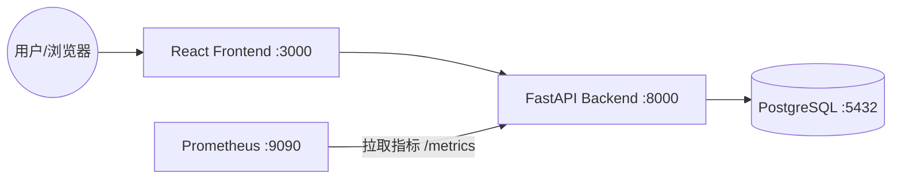

# React + FastAPI + Prometheus 监控示例工程

这是一个演示如何使用 Prometheus 监控 FastAPI 后端服务，并在 React 前端进行展示的完整示例工程。

## 🏗 架构设计



1.  **React Frontend**: 提供交互界面，模拟不同类型的 API 请求（成功、延迟、错误）。
2.  **FastAPI Backend**: 处理业务逻辑，集成 `prometheus-fastapi-instrumentator` 自动暴露监控标准指标。
3.  **PostgreSQL**: 持久化存储业务数据，演示真实数据库读写监控。
4.  **Prometheus**: 定期从后端 `/metrics` 接口拉取（Pull）监控数据。

## 🛠 技术栈
- **Frontend**: React 18 + Tailwind CSS + Lucide Icons
- **Backend**: FastAPI + SQLAlchemy + Pydantic
- **Monitoring**: Prometheus
- **Database**: PostgreSQL 15
- **Infrastructure**: Docker + Docker Compose

## 🚀 启动指南 (How to Run)
1. 确保安装了 **Docker** 和 **Docker Compose**。
2. 在根目录执行：
   ```bash
   docker compose up --build
   ```
3. 等待所有容器启动并健康运行（后端会自动进行数据库迁移）。

## 🔗 服务地址 (Services)
- **Frontend (UI)**: [http://localhost:3000](http://localhost:3000)
- **Backend Swagger**: [http://localhost:8000/docs](http://localhost:8000/docs)
- **Prometheus Dashboard**: [http://localhost:9090](http://localhost:9090)
- **Backend Metrics**: [http://localhost:8000/metrics](http://localhost:8000/metrics)

---

## 📊 监控指标解释

### 1. QPS (每秒查询率)
- **指标名**: `http_requests_total`
- **类型**: Counter (计数器)
- **PromQL 示例**: `rate(http_requests_total[1m])`
- **解释**: 累计请求总数。通常使用 `rate` 函数计算其增长率，反映系统当前的吞吐量。

### 2. 响应时长 (Latency/Duration)
- **指标名**: `http_request_duration_seconds_bucket`
- **类型**: Histogram (直方图)
- **PromQL (P99) 示例**: `histogram_quantile(0.99, sum by (le) (rate(http_request_duration_seconds_bucket[5m])))`
- **解释**: 记录请求处理耗时的分布。P99 表示 99% 的请求都在该耗时以内，是衡量系统性能的关键指标。

### 3. 错误率 (Error Rate)
- **指标名**: `http_requests_total` (通过状态码过滤)
- **PromQL 示例**: `sum(rate(http_requests_total{status=~"5.."}[5m])) / sum(rate(http_requests_total[5m]))`
- **解释**: 服务器错误请求占总请求的比例。

---

## 🧪 测试建议
1. 进入前端页面，点击“成功请求”、“延迟请求”、“错误请求”按钮。
2. 访问 [http://localhost:8000/metrics](http://localhost:8000/metrics) 查看不断更新的数值。
3. 访问 [http://localhost:9090](http://localhost:9090) 在 Graph 页面输入 `http_requests_total` 并点击 Execute 查看图表。
